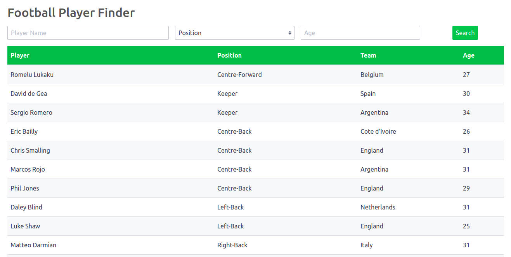

# Football player finder

React app that consumes an API Rest and shows a soccer players list with filters.



### Installation

To run this project, install it locally using yarn. On a terminal, in the root directory:

```bash
yarn

yarn start

yarn test
```

Open a browser and go to http://localhost:3000

### Built it with 🛠️

node 10.15.0

react 16.8.6
redux 4.0.1

spectre 0.5.8

yarn 1.16.0

## License
[MIT](https://choosealicense.com/licenses/mit/)
